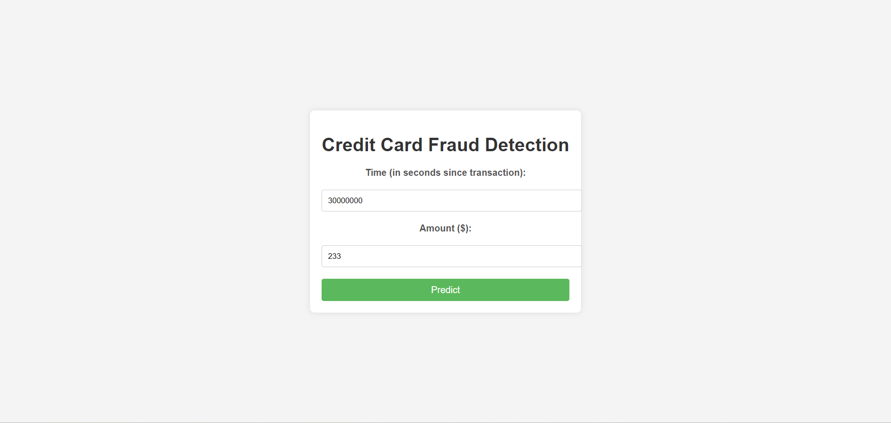
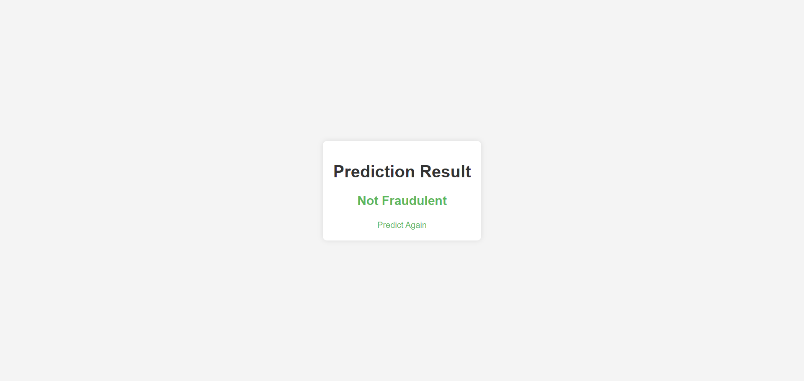

# Credit Card Fraud Detection

This project aims to detect fraudulent credit card transactions using a machine learning model. The application is built using Flask for the backend and a simple HTML form for the frontend. The model predicts fraud based on the `Time` and `Amount` features of the transaction.

# File Structure:
##
```
credit-card-fraud-detection/
│
├── data/
│   └── creditcard.csv
│
├── static/
│   └── css/
│       └── style.css
│
├── templates/
│   ├── index.html
│   └── result.html
│
├── app.py
├── fraud_detection_model.pkl
├── requirements.txt
└── README.md
```
##

# Web Page :

## 1. Home Page:



## 2. Result Page:



## Dataset

The dataset used in this project is the [Credit Card Fraud Detection dataset](https://www.kaggle.com/datasets/mlg-ulb/creditcardfraud) from Kaggle. It contains transactions made by credit cards in September 2013 by European cardholders. This dataset presents transactions that occurred in two days, where we have 492 frauds out of 284,807 transactions. The dataset is highly imbalanced, with the positive class (frauds) accounting for 0.172% of all transactions.

### Features

- `Time`: Number of seconds elapsed between this transaction and the first transaction in the dataset.
- `V1` - `V28`: Result of a PCA transformation.
- `Amount`: Transaction amount.
- `Class`: Target variable (1 for fraudulent transactions, 0 otherwise).

## Installation

To set up this project on your local machine, follow these steps:

### Prerequisites

- Python 3.6 or higher
- Flask
- Scikit-learn
- Pandas
- NumPy

### Steps

1. **Clone the repository**:

   ```bash
   git clone https://github.com/Blacksujit/Credit_Card_Fraud_Prediction-.git
   cd credit-card-fraud-detection

2. **Setup Virtual Environment**:

    ```bash
    python -m venv venv
    ```
    ```bash
     venv\Scripts\activate
    ```
    ```bash
    pip install -r requirements.txt
    ```

3. **Run Code**:

     ```bash
     python app.py
     ```


## Contributing:

Contributions are welcome! Please feel free to submit a Pull Request.

## License:

This project is licensed under the MIT License - see the LICENSE file for details.
 
